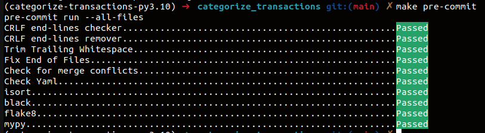
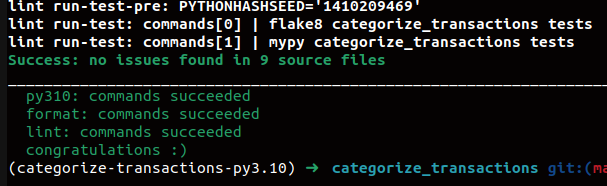
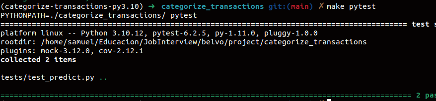

# Pipeline

The pipeline should grab the data, clean it, perform transformations, train the model and make predictions. All while saving the artifacts in the desired location.

Often times, the pipeline does not have a training step if the data scientist performs the steps and just provides the artifacts locations so that the pipeline can perform predictions.

The pipeline should allow the user to provide a `json` file with configurations so that he/she can execute it. The configurations are the data locations and where should the artifacts should go.

For this exercise, I created a pipeline that can train the model and save the transformers and model artifacts in the required location.

The Data Scientist only needs to provide the location of the data. In this case is already in the `artifacts` folder.

The code mainly consists of three steps:
1. Data pulling and transformations: [data_pulling.py](https://github.com/SamuelNavarro/categorize_transactions/blob/main/categorize_transactions/data_pulling.py)
2. Training: [train.py](https://github.com/SamuelNavarro/categorize_transactions/blob/main/categorize_transactions/train.py)
3. Predictions: [predict.py](https://github.com/SamuelNavarro/categorize_transactions/blob/main/categorize_transactions/predict.py)

One important thing is that we are missing a validation and evaluation step in this code. Also, most of the times you would need a lot of steps for merging and cleaning data with external resources.

To build the container and run it:
1. `chmod +x build_docker.sh && ./build_docker.sh`
2. `chmod +x run_pipeline_locally.sh && ./run_pipeline_locally.sh`

The [hosted_pipeline.py](https://github.com/SamuelNavarro/categorize_transactions/blob/main/categorize_transactions/hosted_pipeline.py) code was then used to create a Sagemaker Pipeline.

This showcases that dependency between the steps. For the local run, this is stated in the `entrypoint.sh` file, in which the run the files in the desired order.

For the sake of the exercise, I also allowed the use of `local` storage so the user can see the output in the local filesystem.

You will see the pickle files in the `artifacts` directory.

The process is as follows:
- **Data Collection and Storage**: Raw data is collected and stored in an Amazon S3 bucket (locally in this case), ensuring scalability and security.
- **Data Preprocessing**: The raw data is cleaned, transformed, and prepared for training. This involves handling missing values, encoding categorical variables, and normalizing features. Overtime, this transformations can be customizable depending on our needs.
- **Model Training and Evaluation**: Preprocessed data is used to train ML models. *No evaluation step where created in this step*.
- **Model Deployment (or usage in this case)**: The selected model is used to make predictions. One important detail is that we used the same data from training to make predictions since this is just an exercise.
I produced a dummy model trained on the data provided. This of course has a data leakage problem since even the transaformations where perfomed on this data. Clearly we can only fit transformations on the training set and apply them later to the test set. But since the imporant part of the MLE is the usage of the model, we will ignore that for now.
- **Monitoring and Logging**: The code has logging to enable us to debug or check what would happened in case of any problems. Overtime, I have found that logging is the most usefull thing when it comes to dealing with problems in your pipeline or in your predictions.

## Considerations

### Artifacts
- Benefits of saving the transformations objects and data as middle steps is that you can always go back and check what happened in the pipeline.

### Flexibility trade-off
Here's an important point in to discuss, we either:
1. Let the data scientist perform a lot of experimentation and only provide the data, tranformations and final model, and is the task of the pipeline to gather the data, perform predictions, and save them into the required location.
2. Or we also let the pipeline do the training and saving artifacts. This is important since it will laid out the foundations to set up a retraining pipeline.

There's a trade-off between having a robust pipeline and a flexible one.
Mot of the times, your robust pipeline is for executing training jobs and deploy to prod the new model, with little flexibilty for experimentations. On the other side, we can setup the pipeline to gain a lot of flexibility but lose this robustness since the pipeline itself becomes an experimentation ground. What you gain in flexibility you lose in control over your own pipeline.

The details are important to discuss with the Data Scientist and MLE.

### Data

Most of the times, you are reading parquet data from s3 or other place. Then, you can use the benefits of parquet being a columnar data and combine that with dask, you can really speed up some processes.

In this code, we use parquet as an example.

#### Predictions needed to be produced in real time (<1s per file)
This would be the most exciting project, since the real time inference has a lot of considerations. The pipeline will have to provide the artifacts in a location and we can proceed in the creation of a endpoint that performs the transformations and the predictions.

This of course can get overly complex, and this has to fit in an overall system with:
1. **Data streaming pipelines**: The model depends on data created in real-time.
2. **Static data**: The data is statically stored in external locations.
3. **Endpoint**: The endpoint has to ensure the latency and throughput needs of the system.
4. Others.

And of course, in each component of this system, there has to be considerations regarding problems as missing values, upstream data not available at all, endpoint not handling the data accordingly, etc. All of this potential problems, has to be taken into considerations for the next iteration of the pipeline.

#### The model had to be retrained on a regular basis taking into account user feedback
We already tackle that (in some way) with this repo, in the sense that the pipeline retrieves the data, fits transformers and train a model. It then provides the artifacts needed.

The problem becomes when the underliying model is really different thatn the previous one, for that we no longer have an autorefitting pipeline but a new version of the pipeline. Considerations has to be taken depending on the time requirements, benefits of the new pipeline, etc.

#### Different versions of the model could be trained and served on a self-served manner

This would requiere that the training step allowes the user to set its own parameters, hyperparameters and locations.

We also need to add the functionality that the user sets up a json with parameters for the locations, instances, artifacts and data that he/she requieres. This would need to change the code with `argsparse` and just execute the code by refering to the json file.

The serving can mean a lot of things depending on if the predictions are in batches or in realtime. But mostly, by allowing the user to specify the output location, he/she can pick up the artifacts and use them in their processes by executing the predict step.

### Tools

As stated in the README, the tools used were:

0. `docker`
0. `sagemaker`
1. `pre-commit` which will allow us to have a clean repo.

2. `tox` to test and check everything in an isolated enviroment. The `setup.cfg` file uses `python3.10` (same as Docker).

3. `poetry` to manage dependencies. The Docker container is built on top of the `pyproject.toml` and `poetry.lock` specifications.

4. **Github actions** repo contains two workflows (dev and preview) as examples. It basically runs tox within the actions agent.

5. `Makefile`, that comes from the cookiecutter, it will allow the developer to make an setup command lines to check the code.

