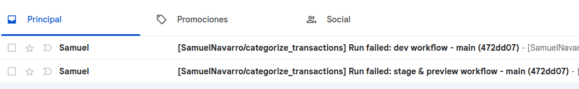

1. Part 1: Design of the machine learning pipeline.
Your task as an MLOps engineer is to design the ML pipeline for the classification problem
above. Said pipeline should focus on providing the tools needed by the ML engineers to
maximize their efficiency. Please, provide a document describing an overview of the whole
pipeline. Then, go into each of the components and provide gradually more detailed information:
which parts is it composed of, which technologies to use at each point, how each part
communicates with the rest of the pipeline, potential issues and how to solve them.


I produced a dummy model trained on the data provided. This of course has a data leakage problem since even the transaformations where perfomed on this data. Clearly we can only fit transformations on the training set and apply them later to the test set. But since the imporant part of the MLE is the usage of the model, we will ignore that for now.


- Benefits of dill is that you can recurse objects that contain functions for your transformers.
- Benefits of saving the transformations objects and data as middle steps is that you can always go back and check what happened in the pipeline.
- dropped celular.
- Logging added: hvae found that is mthe most useful thing for debugging and understanding what happened in the pipeline.
- test, using pytest-mock, and pytest, and pytest-cov. (EXPAND ON THE TESTING)Why the mockers, etc.
- Explain why the usage of the cookiecutter. It gives the goodies on the tox, github actions, ISSUEE templates and so on.
- Mention something about argsparse at least. and how this would be needed for autotrain with configurations.


1. One important thing is that most of the times the data is not clean in the sense that there are duplicates and things like that, but for a production machine learning pipeline you would want to test that everytime.


2. ValueError: A given column is not a column of the dataframe, noise again in the columns


I want to expand on this:

```python
except UnicodeDecodeError:
        df = pd.read_csv(
                s3_path,
                delimiter=";",
                encoding="latin-1",
                low_memory=True,
                decimal=',',
                na_values=' -   ',
                thousands='.',
                parse_dates=[8],
            )
```


Most of the times, you are reading parquet data from s3 or other place. Then, you can use the benefits of parquet being a columnar data and combine that with dask, you can really speed up some processes.
right now this is hardcoded but most of the times, the effort in the data cleaning comes beforehand and you just provide the schema when reading your data.

**Data Leakage Prevention**: Ensure your preprocessing (e.g., scaling) does not introduce data leakage. One common practice is to split your data first into training and test sets and then fit your preprocessing steps (like scaling) on the training set before applying them to both the training and test sets. This practice might require you to adjust your preprocessing approach to fit within a pipeline or to be more mindful of how preprocessing is applied across different subsets of your data.

This redundancy can be especially true for the scaling operation since scaling parameters (mean and standard deviation) should be derived from the training data alone and then applied to both the training and test datasets to prevent data leakage.

Now, I would also like to point out that there's a trade-off between having a robust pipeline for executing training jobs and deploy to prod the new model, with little flexibilty for experimentations. And gaining a lot of flexibility but losing the only final runs of pipelines. What you gain in flexibility you lose in control over your own pipeline.
The details are important to discuss with the Data Scientist and MLE.


Now, moving forward, we would have to operate this in a production environment, the de code to produce and upsert this pipeline in sagemaker is in the `categorize_transaction.py` file.



