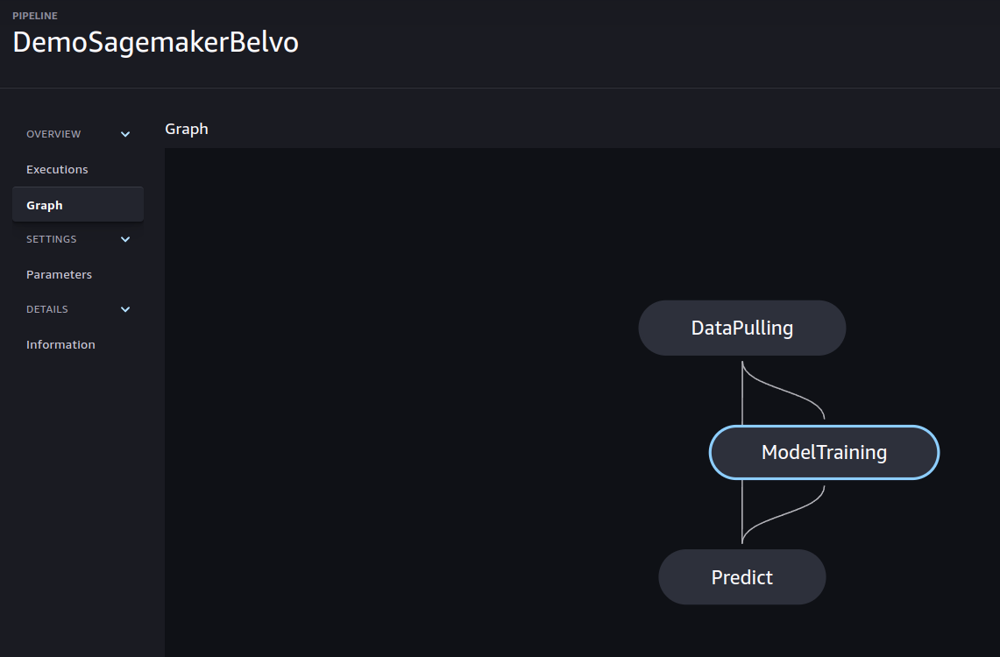

# Categorize Transactions
MLPipeline to predict a category for each transaction


## Pipeline

The pipeline is straighforward and it consists of three steps: DataPulling, ModelTraining and Predict. Details and considerations for the exercise are in the [Details file](./Details.md).

I also provided a `hosted_pipeline.py` file which is the code used to create the pipeline in sagemaker:



This showcases that dependency between the steps. For the local run, this is stated in the `entrypoint.sh` file, in which the run the files in the desired order.

If you want to create the pipeline in your aws account, you will have to set up your credentials and modify the role in the script.

For the sake of the exercise, I also allowed the use of `local` storage so the user can see the output in the local filesystem.

To build the container and run it:
1. `chmod +x build_docker.sh && ./build_docker.sh`
2. `chmod +x run_pipeline_locally.sh && ./run_pipeline_locally.sh`


You will see the pickle files in the `artifacts` directory.


### Tools
I used a combinations of tools that I have found usefull along the way:
0. `docker`
1. `pre-commit` which will allow us to have a clean repo.
2. `tox` to test and check everything in an isolated enviroment. The `setup.cfg` file uses `python3.10` (same as Docker).
3. `poetry` to manage dependencies. The Docker container is built on top of the `pyproject.toml` and `poetry.lock` specifications.
4. **Github actions** repo contains two workflows (dev and preview) as examples. It basically runs tox within the actions agent.
5. `Makefile`, that comes from the cookiecutter, it will allow the developer to make an setup command lines to check the code.


If, by any chanse you want to set up the development environment, you can do so with the following command:
```shell
poetry install -E dev -E test
```


### Testing
I provided a `test_predict.py` file that tests the `predict` step.

And to check all the tools, alongside `pytest`, we use `tox`:
- `tox`

If you only want to run one specific part (linter of formatting for example):
- `tox -e format`


### Credits

This package was created with [Cookiecutter](https://github.com/audreyr/cookiecutter) and the [waynerv/cookiecutter-pypackage](https://github.com/waynerv/cookiecutter-pypackage) project template.
